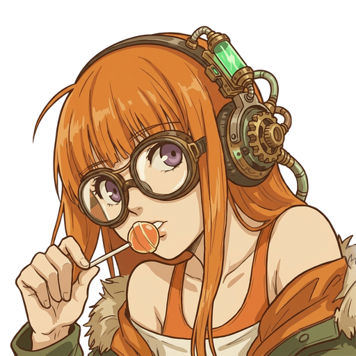
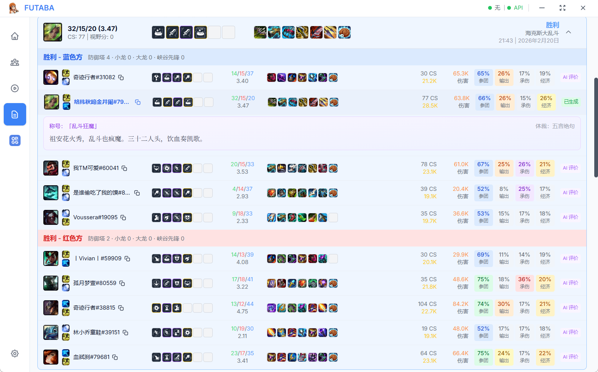
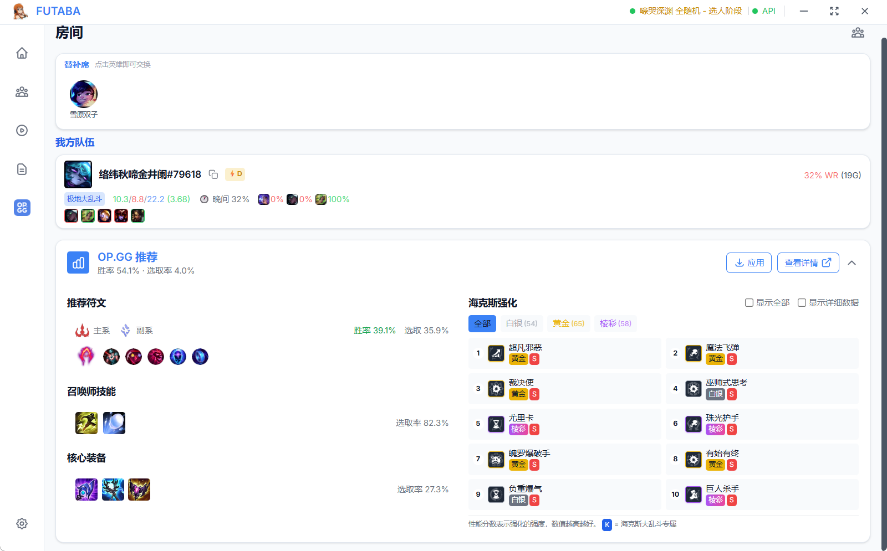
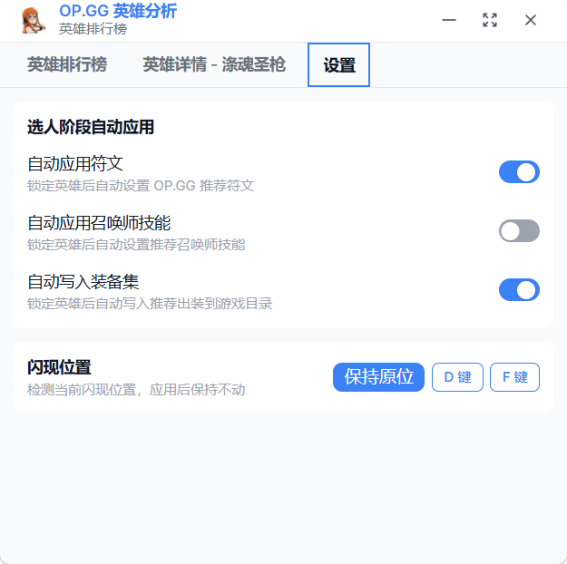

  

    
    </a>

# Futaba

A League of Legends companion client built with Tauri, supporting both desktop and mobile control.

This project is released under the [GPL-3.0](LICENSE) license. Due to previous incidents where malicious users obtained the source code and sold compiled versions online, which goes against the original intent of this project, the source code will not be open-sourced at this stage. It will be open-sourced once the project reaches a certain level of adoption.

## Feedback
QQ Group:1080984368
Github issue:[https://github.com/adv-inn/futaba/issues](https://github.com/adv-inn/futaba/issues)

Features
---
 - [x] Auto-accept matches
 - [x] Match history lookup
 - [x] Friends interaction (chat / invite / scheduled invite)
 - [x] Game mode selection
 - [x] OP.GG enhanced integration (Augment recommendations / item builds / rune pages / summoner spells)
 - [x] Auto counter-pick calculation
 - [x] AI game situation analysis
 - [x] AI post-game review
 - [x] Mobile support (friends / game mode / item builds / augments)

<table>
    <tr>
        <td></td>
    </tr>
</table>

## Main Application

Once the League of Legends client is launched, you can minimize it and use Futaba to take over all other functions. (In ARAM / Hexakill ARAM, you can freely swap champions without timer restrictions)

<table>
    <tr>
        <td></td>
        <td></td>
        <td></td>
    </tr>
    <tr>
        <td></td>
        <td></td>
        <td></td>
    </tr>
</table>

## OP.GG Integration
When you enter champion select, Futaba automatically applies the current patch's strongest item builds, rune pages, and preferred summoner spells based on your selected champion.

In Classic mode (Normal / Ranked), it shows counter and favorable matchups for your selected champion.

In ARAM, it displays the strongest augment recommendations for your champion.

All of these are also accessible on mobile.

<table>
    <tr>
        <td></td>
        <td></td>
    </tr>
    <tr>
        <td></td>
        <td></td>
    </tr>
</table>

## Mobile
Enable LAN data sharing in the settings page. The app will broadcast a `futaba.local` domain via mDNS, which you can visit to access the web interface.

For convenience, you can also scan the QR code displayed on the app page for quick access.

All communication happens locally on your network — no external servers, fully secure.

Now you can accept matches and pick champions even while grabbing takeout or taking a break.

<table>
    <tr>
        <td></td>
        <td></td>
    </tr>
    <tr>
        <td></td>
        <td></td>
    </tr>
</table>

## Download

Via [releases](https://github.com/adv-inn/Futaba/releases). I'd appreciate it if you download from GitHub so I can track actual download counts.
